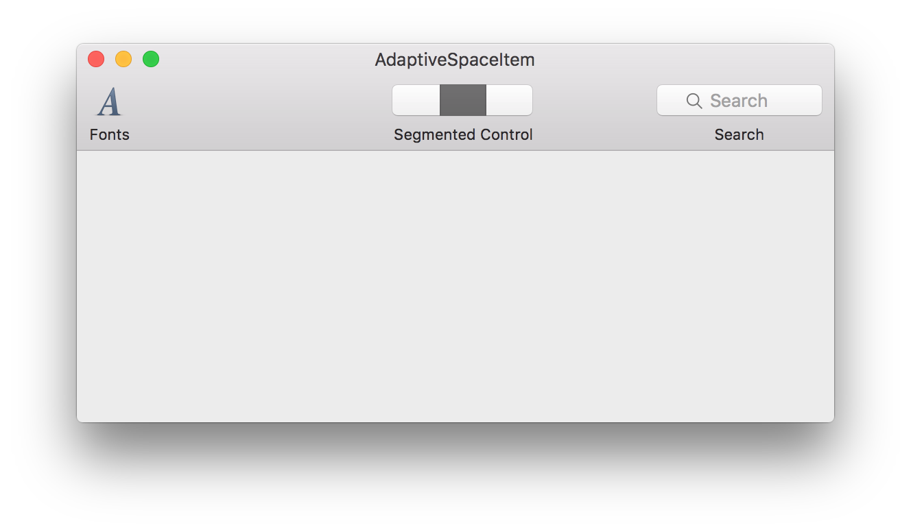

# AdaptiveSpaceItem

[](https://travis-ci.org/recisio/AdaptiveSpaceItem)

[](https://github.com/recisio/AdaptiveSpaceItem)
[](http://cocoadocs.org/docsets/AdaptiveSpaceItem)
[](http://cocoapods.org/pods/AdaptiveSpaceItem)

AdaptiveSpaceItem is a NSToolbarItem subclass which will create space to center the next toolbar item.



## Installation

### Cocoapods Installation

AdaptiveSpaceItem is available on CocoaPods. Just add the following to your Podfile:

```
pod 'AdaptiveSpaceItem'
```

### Swift Package Manager

AdaptiveSpaceItem is available on SPM. Just add the following to your Package file:

```swift
import PackageDescription

let package = Package(
    dependencies: [
        .Package(url: "https://github.com/recisio/AdaptiveSpaceItem.git", majorVersion: 1)
    ]
)
```

### Manual Installation

Just drag the `Source/*.swift` files into your project.

## Usage

Using Interface Builder add an "Image Toolbar Item" to your toolbar and set its class to TAAdaptiveSpaceItem. The next item will be centered in the toolbar.

## What's next

- Your ideas!

## Contribution

- If you found a **bug**, open an **issue**
- If you have a **feature request**, open an **issue**
- If you want to **contribute**, submit a **pull request**

## Licence

AdaptiveSpaceItem is available under the MIT license. See the LICENSE file for more info.
